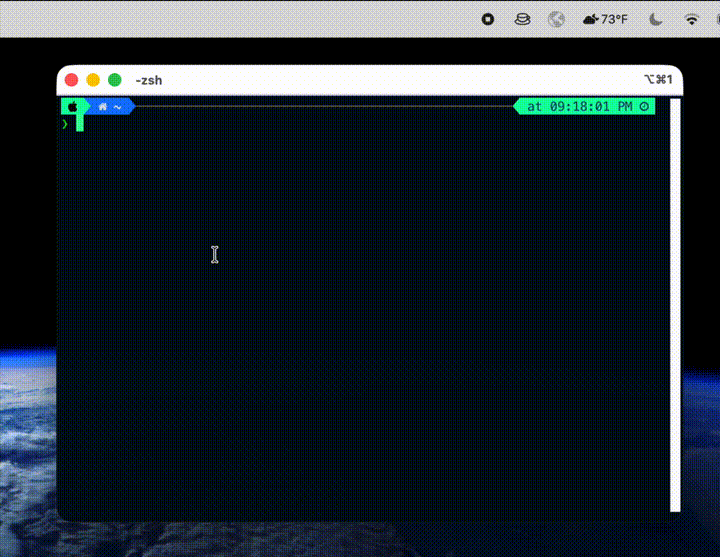

# Awake

Close the lid. Keep the work running.

[](https://github.com/pistachionet/awake/releases)
[](#install)
[](https://github.com/pistachionet/homebrew-awake)
[](LICENSE)

Awake is a tiny macOS menu bar app that keeps your MacBook awake while the lid is
closed. It is built for long-running terminal jobs, downloads, syncs, local
servers, and coding agent sessions that should not stop when you step away.

<p align="center">
  
</p>

## Install

```sh
brew install --cask pistachionet/awake/awake
```

Then launch Awake from Spotlight or Applications, click the menu bar cup icon,
and choose **Grant permission (one-time)...**.

## Quick Start

1. Launch Awake.
2. Click the cup icon in the menu bar.
3. Choose **Grant permission (one-time)...** and enter your Mac password.
4. Turn on **Keep awake with lid closed**.
5. Close the lid. Your work keeps running.

## Use Cases

Awake is useful whenever work should keep running after you close the lid:

- Running Claude Code, OpenCode, Cursor agents, or other coding agents.
- Keeping long terminal jobs alive.
- Running local dev servers while stepping away.
- Letting package installs, builds, scripts, or migrations finish.
- Continuing downloads, uploads, cloud syncs, and backups.
- Keeping SSH sessions, Docker jobs, and automation alive.
- Listening to music with the lid closed.
- Any task that normally requires leaving your MacBook open.

## How It Works

Awake toggles macOS' `SleepDisabled` power setting with `pmset`:

```sh
pmset -a disablesleep 1
```

That is the main difference from `caffeinate`: `caffeinate` creates temporary
sleep-prevention assertions, while Awake changes the system power setting that
controls lid-close sleep. Awake is for the lid-closed case.

Because `pmset` must run as root to change power settings, Awake asks for one
authenticated admin grant. That grant writes a narrow sudoers rule at:

```sh
/etc/sudoers.d/awake
```

The rule allows exactly two commands without a password:

```sh
/usr/bin/pmset -a disablesleep 1
/usr/bin/pmset -a disablesleep 0
```

Nothing else gets elevated. Awake does not ship with root privileges.

## Menu Options

- **Keep awake with lid closed**: toggles lid-close sleep off or on.
- **Launch at login**: starts Awake automatically when you sign in.
- **Grant permission (one-time)...**: installs the narrow sudoers rule.
- **Remove permission...**: turns sleep back on and deletes the sudoers rule.
- **Quit Awake**: restores normal sleep before quitting.

## Safety Notes

- Battery drains faster with lid-close sleep disabled.
- The internal display may stay on; turn brightness down before closing the lid.
- Avoid long heavy CPU or GPU workloads while fully closed, especially in a bag.
- macOS can still force sleep at critically low battery.

## Uninstall

```sh
brew uninstall --zap awake
```

`--zap` removes the sudoers rule at `/etc/sudoers.d/awake` in addition to the app.

## Build From Source

```sh
git clone https://github.com/pistachionet/awake.git
cd awake
bash scripts/build.sh
open build/Awake.app
```

Right-click and choose **Open** the first time if Gatekeeper blocks the local
unsigned build.

<p align="center">
  
</p>
